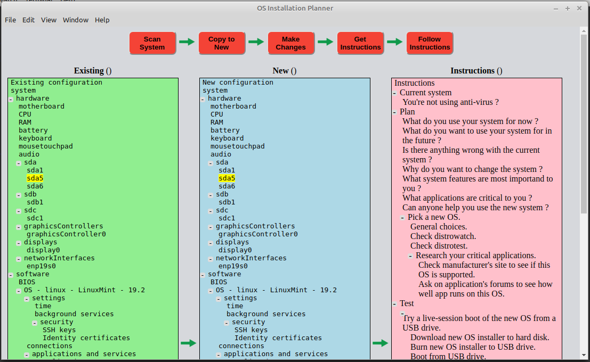

# OS Installation Planner
Electron desktop application to plan and pre-configure a single-user desktop OS installation.

[IN PROTOTYPING STAGE; DO NOT USE !!!]

## Functionality

* User runs this application on their existing Windows, Mac or Linux system.
* Application scans existing system and lists hardware, software, security, and network settings.
* User can copy existing configuration to new configuration.
* User can modify new configuration to change to different OS, or dual-booting two OS's, etc.
* Application provides wizards to help user figure out what they want.
* Application produces a set of instructions for doing the installation.
* Application produces a pre-seeding or setup-automation file to be used as input to the standard OS installer.

## Use

1. Launch the application.
1. See main window:

3. Click on "Scan system" button.
1. See settings of existing system appear in left tree pane.
1. Click on "Copy to New" button.
1. See settings copied from existing system appear in middle tree pane.
1. Click on "Change" button, and see wizard appear asking what user wants to do.
1. Or: Right-click on items in the middle tree and edit them.
1. When middle tree is finished, click on "Get Instructions" button.
1. See instructions appear in right tree pane.
1. Print or copy the instructions.
1. Follow the instructions to change your system.

### Limitations

* Before doing "Scan System", enable all networks (Wi-Fi and wired), and attach and mount all USB devices (drives, printers, etc), so the application can scan them.  If something such as Wi-Fi is disabled, probably it won't be found by the application.

#### Quirks

---

## Install

---

## Releases

---

## Development
### To-Do list
* Hard-coded path to Electron in package.json

### Development Environment
I'm no expert on this stuff, maybe I'm doing some things stupidly.

I used:
* Electron 

I did:

---

## Privacy Policy
This application doesn't collect, store or transmit your identity or personal information outside your machine in any way.  It only reads and writes files that you specify.

